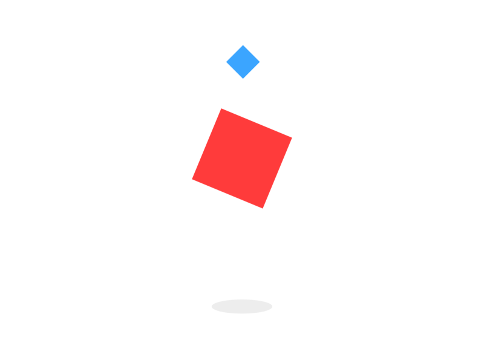

    

    

    
    
    
    
    
    
    
    
    
    
    
    
    
    
    
    
    

## Demo
https://snappmarket.github.io/IconBox/

## How to use it ?

Icons are available in `svg` format, `react` components and a special way of `sprite` file which allows you to sprite svg icons
in a pack. e.g. if you are using `webpack` you could use [svg-sprite-loader](https://github.com/JetBrains/svg-sprite-loader)

## licence 
This repo is just a wrapper to exist icon packs, so please respect every icon pack licence you use.

- **Clothes**: free icon pack from [flat icons](https://www.flaticon.com/)
- **Eid**: free icon pack from [flat icons](https://www.flaticon.com/)
- **Emoji**: free icon pack from [flat icons](https://www.flaticon.com/)
- **Eva Icons**: [MIT](https://github.com/akveo/eva-icons#license)
- **Feather Icons**: free icon pack from [flat icons](https://www.flaticon.com/)
- **Font awesome icons** : [CC BY 4.0 License](https://github.com/FortAwesome/Font-Awesome#license)
- **Foundation**: [MIT](https://github.com/zurb/foundation-icons)
- **IcoMoon**: [GPL / CC BY 4.0](https://github.com/Keyamoon/IcoMoon-Free), [GPL / CC BY 4.0](https://icomoon.io/app/#/select/library)
- **Iconly**: free icon pack from [flat icons](https://www.flaticon.com/)
- **Ion Icons**: [MIT](https://github.com/ionic-team/ionicons#license)
- **Linear Icons**: [CC BY-SA 4.0](https://linearicons.com/free)
- **Material Design Icons**: [Apache license version 2.0.](https://material.io/resources/icons)
- **Medial Icons**: free icon pack from [flat icons](https://www.flaticon.com/)
- **Oct Icons**: [MIT](https://github.com/primer/octicons#license)
- **SnappMarket Icons**: [MIT](http://snapp.market)
- **Support Icons**: free icon pack from [flat icons](https://www.flaticon.com/)
