<a href="https://iconbox.space" target="_blank">
    

        
    

    

        
    

</a>

    A world of famous icon packs with easy to use interface
     

    <a href="https://iconbox.space/?package=Clothes" target="_blank">
        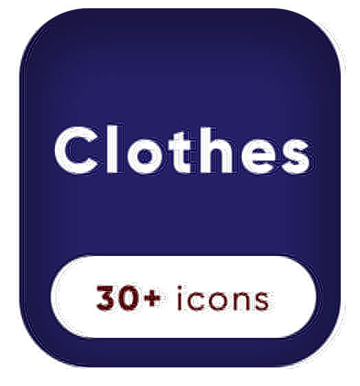
    </a>
    <a href="https://iconbox.space/?package=Eid" target="_blank">
        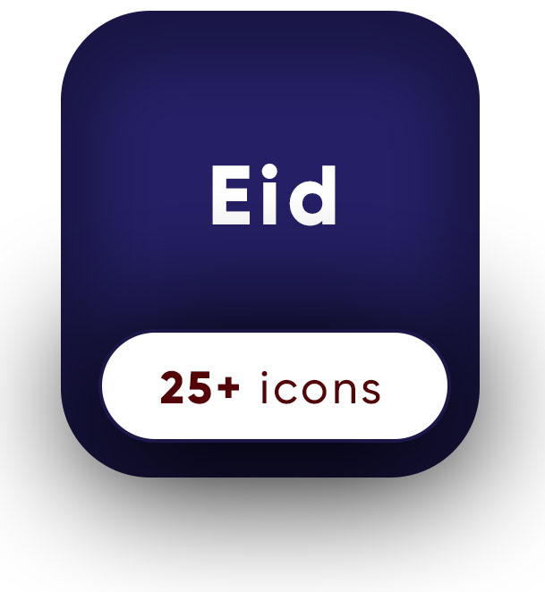
    </a>
    <a href="https://iconbox.space/?package=Emoji" target="_blank">
        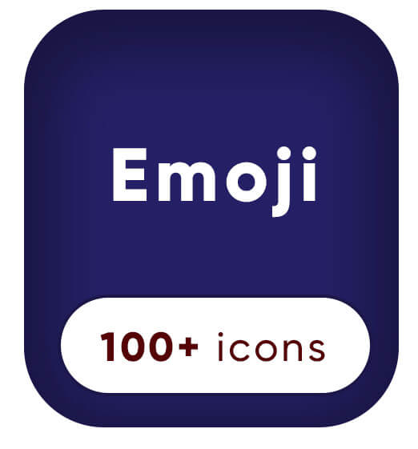
    </a>
    <a href="https://iconbox.space/?package=Eva" target="_blank">
        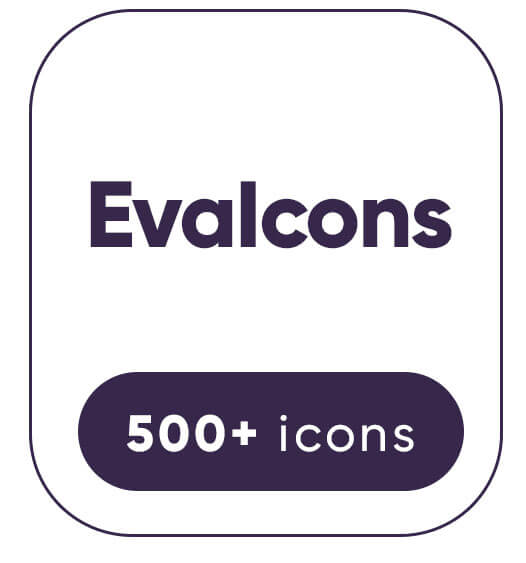
    </a>
    <a href="https://iconbox.space/?package=Feather" target="_blank">
        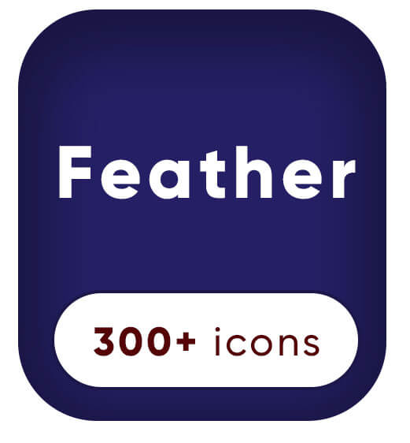
    </a>
    <a href="https://iconbox.space/?package=FontAwesome4" target="_blank">
        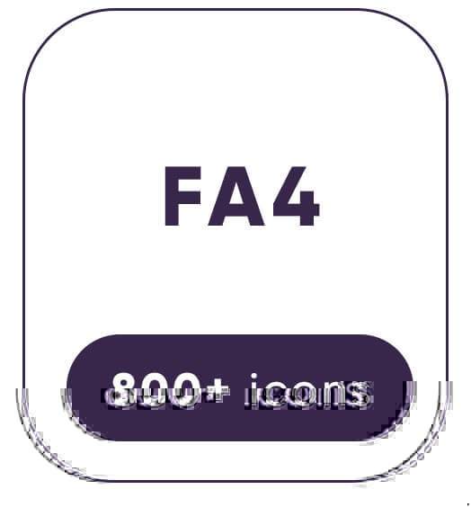
    </a>
    <a href="https://iconbox.space/?package=FontAwesome5" target="_blank">
        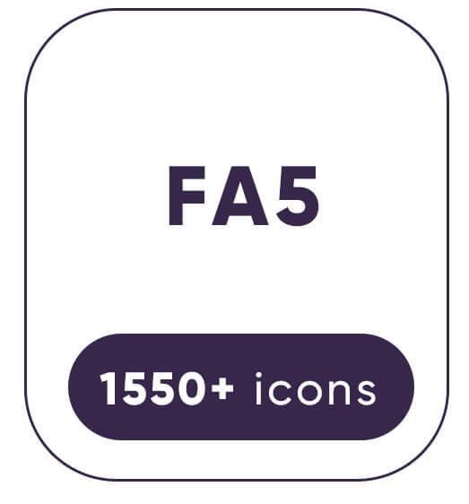
    </a>
    
    <a href="https://iconbox.space/?package=Icomoon" target="_blank">
        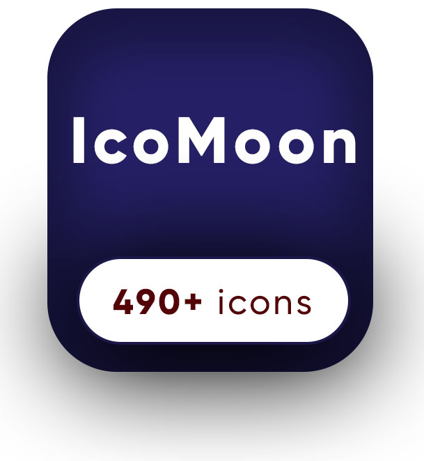
    </a>
    
    <a href="https://iconbox.space/?package=IonIcons" target="_blank">
        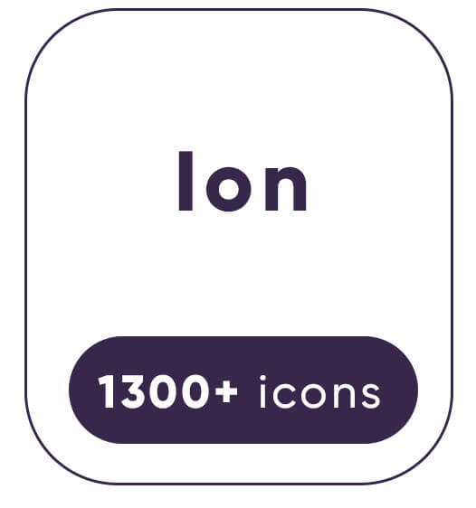
    </a>
    
    <a href="https://iconbox.space/?package=Material" target="_blank">
        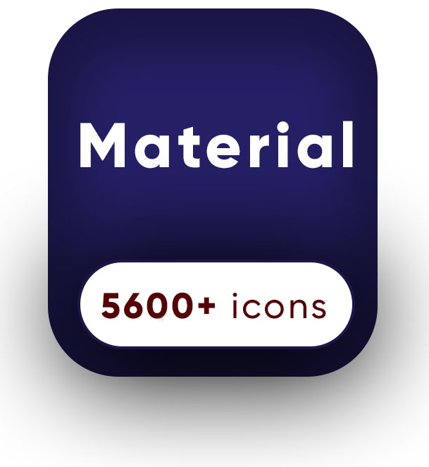
    </a>
    <a href="https://iconbox.space/?package=Medical" target="_blank">
        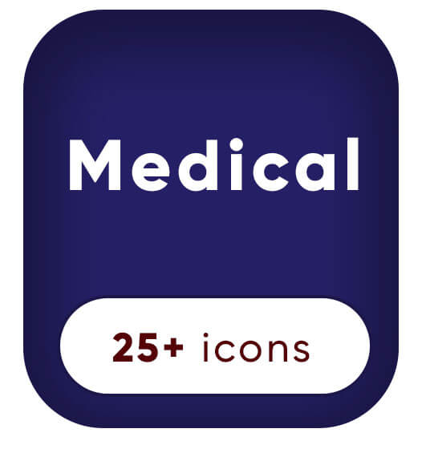
    </a>
    
    <a href="https://iconbox.space/?package=Snappmarket" target="_blank">
        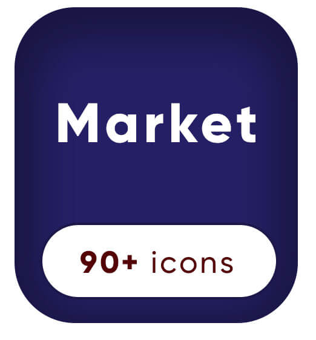
    </a>
    <a href="https://iconbox.space/?package=Support" target="_blank">
        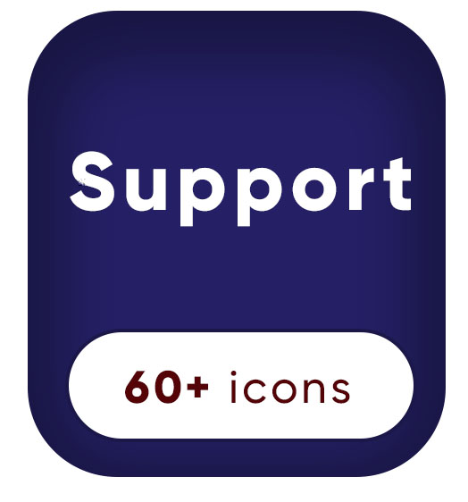
    </a>
    

## Why iconbox? I like font icons!

| Icon Font                                                                                                                                                                                                                                                                                                                                                                                                                                                                                                                                                                                                                                                                                                                   | Inline SVG                                                                                                                                                                                                     |
|-----------------------------------------------------------------------------------------------------------------------------------------------------------------------------------------------------------------------------------------------------------------------------------------------------------------------------------------------------------------------------------------------------------------------------------------------------------------------------------------------------------------------------------------------------------------------------------------------------------------------------------------------------------------------------------------------------------------------------|----------------------------------------------------------------------------------------------------------------------------------------------------------------------------------------------------------------|
| Browsers consider it text, so the icons are anti-aliased as such. Can lead to icons not being as sharp as you might expect.                                                                                                                                                                                                                                                                                                                                                                                                                                                                                                                                                                                                 | Straight up vector                                                                                                                                                                                             |
| You can control the size (via `font-size`), color, shadows, rotation, etc. via CSS.                                                                                                                                                                                                                                                                                                                                                                                                                                                                                                                                                                                                                                         | You have all the same CSS control as with a font, but better, because you can 1) control individual parts of a multi-part icon and 2) use SVG-specific CSS like stroke properties. Also could be multi-color.  |
| It can be frustrating to position a font icon. The icons are inserted via pseudo element, and it depends on line-height , vertical-align, letter-spacing, word-spacing, how the font glyph is designed (does it naturally have space around it? does it have kerning information?). Then the pseudo elements display type affects if those properties have an effect or not.                                                                                                                                                                                                                                                                                                                                                | SVG just is the size that it is.                                                                                                                                                                               |
| An icon font might fail because 1) it’s being loaded cross-domain without the proper CORS headers and Firefox doesn’t like that 2) for any reason, the font file fails to load (network hiccup, server failure, etc) 3) There is some weird Chrome bug that dumps the @font-face and shows a fallback font instead 4) Surprising browser doesn’t support @font-face. Font failures are pretty common for a variety of reasons. Plus, if you try and do something clever like map icons to “Private Use Area” of unicode and the font fails, it may do something really weird like show an unexpected emoji, because the environment you’re in uses that same area for emoji. Or that emoji might even overrule your glyphs! | Inline SVG is right in the document. If the browser supports it, it displays it.                                                                                                                               |
| Proxy browsers like Opera Mini or UC Browser don’t support @font-face at all, even though they sometimes report that they do. So even if you try to feature detect, it may fail. Some people force their own fonts over yours, for example in a user stylesheet or a browser extension specifically for applying custom styles. For instance, one that applies a font   better for people with dyslexia. (More on the issues with icon font accessibility from Seren D.) Blocking technology can either automatically or offer to block custom fonts.                                                                                                                                                                       | Even those proxy browsers support SVG. Blockers don’t care about SVG.                                                                                                                                          |
| To use responsibly, you’re injecting the icon via a pseudo element on an (empty). Either bad or no semantics, depending on how you feel about that kind of thing.                                                                                                                                                                                                                                                                                                                                                                                                                                                                                                                                                     | Icons are little images. The semantics of `<svg>` says “I’m an image.” Seems better to me.                                                                                                                     |
| You have to be quite careful with icon fonts to make sure you do it in an accessible way. You should basically do everything in   this article. You’re always fighting to make sure that the icon itself isn’t read (but something else is) and that hard-to-detect fail states are handled.                                                                                                                                                                                                                                                                                                                                                                                                                                | Research suggests using the proper combination of elements and attributes (`<title>`, `<desc>`, and `aria-labelledby`) you can convey good information across the browser specturm. Plus no weird fail states. |
| Using a pre-created icon font was never particularly responsible (too many unused icons). Creating your own icon font was never overly comfortable. I think the best were   Pictos Server(limited to Pictos icons) and IcoMoon (free login to save projects). Fontello has an API I didn’t see it used to make a good build tool.                                                                                                                                                                                                                                                                                                                                                                                           | The inline SVG system is easier because you can do it all by hand if needed. Or use a tool like IcoMoon (exports either way). Or use a   build tool.                                                           |
| Very deep. Even IE 6.                                                                                                                                                                                                                                                                                                                                                                                                                                                                                                                                                                                                                                                                                                       | Decent, but problems are IE 8- and Android 2.3-. Fallbacks doable but not wonderful.                                                                                                                           |
|                                                                                                                                                                                                                                                                                                                                                                                                                                                                                                                                                                                                                                                                                                                             |                                                                                                                                                                                                                |

## How to use it ?

Icons are available in `svg` format, `react` components and a special way of `sprite` file, which allows you to sprite svg icons
in a pack. e.g. if you are using `webpack` you could use [svg-sprite-loader](https://github.com/JetBrains/svg-sprite-loader)

## licence 
This repo is just a wrapper to exist icon packs, so please respect every icon pack licence you use.

- **Clothes**: free icon pack from [flat icons](https://www.flaticon.com/)
- **Eid**: free icon pack from [flat icons](https://www.flaticon.com/)
- **Emoji**: free icon pack from [flat icons](https://www.flaticon.com/)
- **Eva Icons**: [MIT](https://github.com/akveo/eva-icons#license)
- **Feather Icons**: free icon pack from [flat icons](https://www.flaticon.com/)
- **Font awesome4 icons** : [CC BY 4.0 License](https://github.com/FortAwesome/Font-Awesome#license)
- **Font awesome5 icons** : [CC BY 4.0 License](https://github.com/FortAwesome/Font-Awesome#license)
- **Foundation**: [MIT](https://github.com/zurb/foundation-icons)
- **IcoMoon**: [GPL / CC BY 4.0](https://github.com/Keyamoon/IcoMoon-Free), [GPL / CC BY 4.0](https://icomoon.io/app/#/select/library)
- **Iconly**: free icon pack from [flat icons](https://www.flaticon.com/)
- **Ion Icons**: [MIT](https://github.com/ionic-team/ionicons#license)
- **Linear Icons**: [CC BY-SA 4.0](https://linearicons.com/free)
- **Material Design Icons**: [Apache license version 2.0.](https://material.io/resources/icons)
- **Medial Icons**: free icon pack from [flat icons](https://www.flaticon.com/)
- **Oct Icons**: [MIT](https://github.com/primer/octicons#license)
- **SnappMarket Icons**: [MIT](http://snapp.market)
- **Support Icons**: free icon pack from [flat icons](https://www.flaticon.com/)
